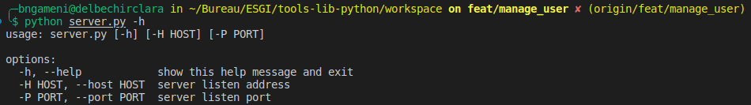
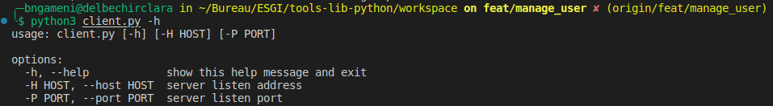
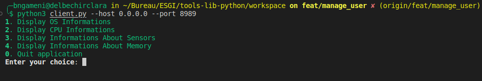

# Tools-lib-python
Toolkit for have some informations about os in python

# Requirements

* Linux server
* At leat 4Go RAM and 2 CPU
* python3 and python3-pip installed


# Install application

* Clone the repository

    ```bash
        $ git clone https://github.com/my-esgi-projects/tools-lib-python.git
    ```


* Install requirements

    ```bash
        $ cd tools-lib-python/
        $ python3 -m pip install -r requirements.txt
    ```

* Enter in workspace directory
    ```bash
        $ cd workspace
    ```


## Client-Server application using socket

Ps: Here you have two scripts to launch. First server script and client script after.


### Server script

* Display help

    ```bash
        python3 server.py -h
    ```
    


* Launch server script
    ```bash
        python3 server.py --host 0.0.0.0 --port 8989
    ```

### Client Script

* Display help
    ```bash
        python3 client.py -h
    ```
    

* Launch client script
    ```bash
        python3 client.py --host 0.0.0.0 --port 8989
    ```
    


## User-Groups creation script

* Display help

    ```bash
        python3 user.py -h
    ```
    

* Launch script
    ```bash
        python3 user.py --file user_file/file.txt
    ```


