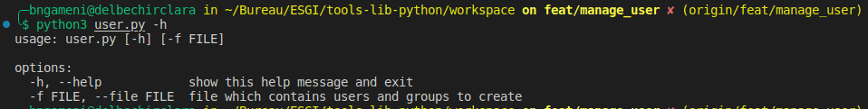

# Tools-lib-python
Toolkit for have some informations about OS in python

&nbsp;
# Requirements

* Linux server
* At leat 2Go RAM and 1 CPU
* python3 and python3-pip installed

&nbsp;
# Install application

* Clone the repository

```console
bngameni@delbechirclara:$ git clone https://github.com/my-esgi-projects/tp-tools-lib-python.git
Cloning into 'tp-tools-lib-python'...
remote: Enumerating objects: 130, done.
remote: Counting objects: 100% (130/130), done.
remote: Compressing objects: 100% (83/83), done.
remote: Total 130 (delta 50), reused 110 (delta 39), pack-reused 0
Receiving objects: 100% (130/130), 141.92 KiB | 2.25 MiB/s, done.
Resolving deltas: 100% (50/50), done
```

* Install requirements

```console
bngameni@delbechirclara:$ cd tp-tools-lib-python/
bngameni@delbechirclara:$ python3 -m pip install -r requirements.txt
```

* Enter in workspace directory
```console
bngameni@delbechirclara:$ cd workspace
```
&nbsp;

## Client-Server application using socket

> * For test this, [Install application both client side and server side](#install-application)
> * Here you have two scripts to launch. First server script and client script after.

&nbsp;

### Server script

* Display help

```console
bngameni@delbechirclara:$ python server.py -h
usage: server.py [-h] [-H HOST] [-P PORT]

Launch without options will use localhost as default host and 8090 as defaut port

options:
  -h, --help            show this help message and exit
  -H HOST, --host HOST  server listen address
  -P PORT, --port PORT  server listen port
```

* Launch server script

```console
bngameni@delbechirclara:$ python3 server.py --host 0.0.0.0 --port 8989

```

> * Server is muted when it's launched

&nbsp;

### Client Script

* Display help
```console
bngameni@delbechirclara:$ python client.py -h
usage: client.py [-h] [-H HOST] [-P PORT]

Launch without options will use localhost as default host and 8090 as defaut port

options:
  -h, --help            show this help message and exit
  -H HOST, --host HOST  server listen address
  -P PORT, --port PORT  server listen port
```

* Show network interface of client server
```console
bngameni@ansible-dev:$ ip a
1: lo: <LOOPBACK,UP,LOWER_UP> mtu 65536 qdisc noqueue state UNKNOWN group default qlen 1000
    link/loopback 00:00:00:00:00:00 brd 00:00:00:00:00:00
    inet 127.0.0.1/8 scope host lo
       valid_lft forever preferred_lft forever
    inet6 ::1/128 scope host 
       valid_lft forever preferred_lft forever
2: enp0s3: <BROADCAST,MULTICAST,UP,LOWER_UP> mtu 1500 qdisc fq_codel state UP group default qlen 1000
    link/ether 08:00:27:18:52:78 brd ff:ff:ff:ff:ff:ff
    inet 10.0.2.15/24 brd 10.0.2.255 scope global dynamic enp0s3
       valid_lft 84917sec preferred_lft 84917sec
    inet6 fe80::a00:27ff:fe18:5278/64 scope link 
       valid_lft forever preferred_lft forever
3: enp0s8: <BROADCAST,MULTICAST,UP,LOWER_UP> mtu 1500 qdisc fq_codel state UP group default qlen 1000
    link/ether 08:00:27:6b:f0:dc brd ff:ff:ff:ff:ff:ff
    inet 192.168.1.45/24 brd 192.168.1.255 scope global dynamic enp0s8
       valid_lft 84917sec preferred_lft 84917sec
    inet6 2001:861:5e49:aa00:a00:27ff:fe6b:f0dc/64 scope global dynamic mngtmpaddr noprefixroute 
       valid_lft 86400sec preferred_lft 14400sec
    inet6 fe80::a00:27ff:fe6b:f0dc/64 scope link 
       valid_lft forever preferred_lft forever
4: docker0: <NO-CARRIER,BROADCAST,MULTICAST,UP> mtu 1500 qdisc noqueue state DOWN group default 
    link/ether 02:42:0d:2c:24:e7 brd ff:ff:ff:ff:ff:ff
    inet 172.17.0.1/16 brd 172.17.255.255 scope global docker0
       valid_lft forever preferred_lft forever

```

* Launch client script
```console
bngameni@delbechirclara:$ python3 client.py --host 192.168.1.94 --port 8989
1. Display OS Informations
2. Display CPU Informations
3. Display Informations About Sensors
4. Display Informations About Memory
0. Quit application
Enter your choice: 1
         1. Show os name
         2. Show os architecture
         3. Show os release
         4. Show os hostname
         0. Back to main menu
Enter your choice: 1
 The os name is : Linux
         1. Show os name
         2. Show os architecture
         3. Show os release
         4. Show os hostname
         0. Back to main menu
Enter your choice: 2
 The architecture of os is : x86_64
         1. Show os name
         2. Show os architecture
         3. Show os release
         4. Show os hostname
         0. Back to main menu
Enter your choice: 3
 The release of os is : 5.19.0-41-generic
         1. Show os name
         2. Show os architecture
         3. Show os release
         4. Show os hostname
         0. Back to main menu
Enter your choice: 4
 The hostname is : delbechirclara
         1. Show os name
         2. Show os architecture
         3. Show os release
         4. Show os hostname
         0. Back to main menu
Enter your choice: 0
1. Display OS Informations
2. Display CPU Informations
3. Display Informations About Sensors
4. Display Informations About Memory
0. Quit application
Enter your choice: 0
         Are you sure to quit ?(yes/no)

Enter your choice: yes
bngameni@delbechirclara:$ 
```
&nbsp;

> * Only first menu is showed on this readme.

&nbsp;


## Filter automation using iptables on linux server from client script in python


&nbsp;
## User-Groups creation script

* Display help

    ```bash
        python3 user.py -h
    ```
    

* Launch script
    ```bash
        python3 user.py --file files/file.txt
    ```


